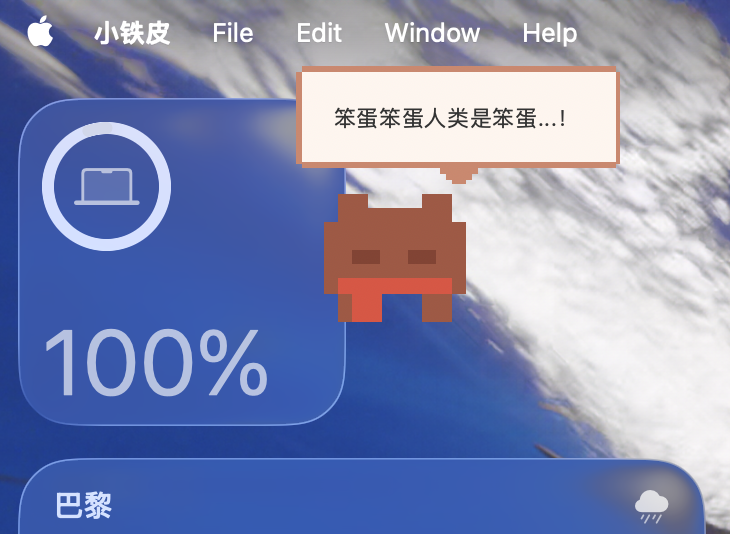

# 🤖 小铁皮 


> 一只会读论文的胖像素宠物

<p align="center">
  
</p>

## 它是什么？

小铁皮是一个桌面宠物，但它不只是卖萌——它每天帮你：

- 自动从 arXiv/bioRxiv 抓取论文
- 根据你的口味打分推荐
- 和你讨论论文内容
- 把讨论整理成笔记

同时它还会饿、会困、会生病、会做梦，养胖了会变圆。

## 为什么做这个？

因为博士生每天要读论文，但读论文很枯燥。
所以我做了一个会读论文的电子宠物。
现在读论文变成了"喂宠物"。

## 功能

### 学术助手

| 功能 | 描述 |
|------|------|
| 学术日报 | 每天自动抓取你领域的新论文 |
| 品味学习 | 根据你的 👍👎 反馈学习你喜欢什么类型 |
| 论文讨论 | 可以针对具体论文提问，它会记得上下文 |
| 笔记导出 | 把讨论内容总结成笔记，保存到本地 |
| 收藏功能 | 收藏感兴趣的论文，稍后阅读 |

### 宠物系统

| 功能 | 描述 |
|------|------|
| 心情系统 | 小铁皮有心情值，需要你关心 |
| 饥饿系统 | 记得喂它，不然会变瘦 |
| 梦境系统 | 它会做梦——美梦加心情，噩梦需要你摸摸头 |
| 体型变化 | 喂太多会变胖，饿着会变瘦 |
| 气泡通知 | 它会主动冒泡告诉你有好论文 |

## 演示
小铁皮精灵图预览：


日常展示：


论文功能展示：


## 安装

### 前置要求

- Python 3.8+
- Anthropic API key（用于 AI 功能）

### 安装步骤

```bash
# 克隆仓库
git clone https://github.com/Swomendl/xiaotiepi.git
cd xiaotiepi

# 安装依赖
pip install -r requirements.txt

# 设置 API key
export ANTHROPIC_API_KEY=你的key

# 运行
python main.py
```

### 设置开机自启（可选）

macOS 用户可以把小铁皮添加到登录项，这样每天开机它就自动运行：

1. 打开「系统设置」→「通用」→「登录项」
2. 点击「+」添加小铁皮

## 配置

首次运行时，小铁皮会在 `~/.xiaotiepi/` 创建配置文件：

```
~/.xiaotiepi/
├── pet_data.json      # 宠物状态（心情、饥饿等）
├── paper_data.json    # 今日论文数据
├── taste_profile.json # 你的口味偏好
├── chat_history.json  # 聊天记录
├── bookmarks.json     # 收藏的论文
└── notes/             # 导出的笔记
```

### 自定义关键词

编辑 `paper_agent/config.py` 可以设置你感兴趣的研究领域：

```python
SEED_KEYWORDS = {
    'primary': ['protein structure prediction', 'protein-RNA interaction'],
    'methods': ['AlphaFold', 'diffusion model', 'graph neural network'],
    'tools': ['ESM', 'RoseTTAFold', 'ProteinMPNN']
}
```

## 技术栈

- **界面**: Python + tkinter
- **AI**: Claude API (Haiku)
- **论文源**: arXiv API, bioRxiv API
- **像素美术**: 手绘（灵感来自某个橙色 AI 🧡）

## 使用技巧

1. **每天早上看一眼学术日报**：小铁皮已经帮你筛选好了
2. **看到感兴趣的论文点 ⭐ 收藏**：之后可以慢慢看
3. **有问题直接问它**：它记得你们聊过什么
4. **聊完点 📝 保存笔记**：以后写论文能用上
5. **记得喂它**：不然它会饿肚子

## 贡献

欢迎提 issue 和 PR！

如果你也是被论文淹没的研究生/博士生，欢迎一起让小铁皮变得更好用。

## 致谢

- 小铁皮的视觉设计灵感来自 [Claude](https://claude.ai) 的像素形象
- 感谢 [Anthropic](https://anthropic.com) 让 AI 变得可爱又有用
- 感谢每一个被论文折磨却依然热爱科研的人

## License

MIT License - 随便用，记得喂小铁皮就行

---

<p align="center">
  <em>"我虽然胖，但我读论文很快"</em>
  <br>
  —— 小铁皮
</p>
